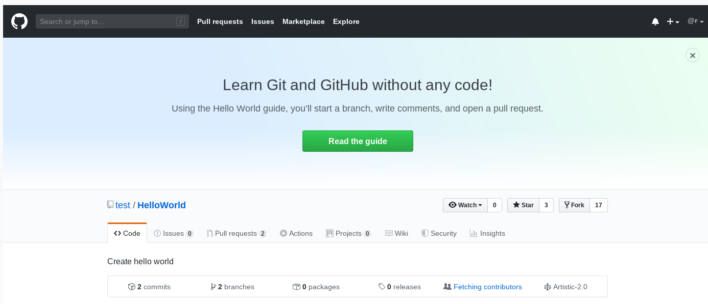

# 項目分叉 (Forking) 與合作

在[《如何創建和配置自己的本地及遠端 Repo》](repo-config.md) [1]
一文中，我們以情景描述方式（也就是舉例的方式）演示了
* 如何把您的本地 repo 推送到您在 [GitHub](https://github.com) 和/或
    [GitLab](https://gitlab.com) 的賬號下，從而在 GitHub 和/或 GitLab 上創建遠端
    repo；或者如何把您在 GitHub 或 GitLab 上的 repo 克隆為您的本地 repo；
* 如何使您的本地 repo 和它的遠端 repo 之間保持數據同步。

總之，該文主要解決的是您自己的 repo 之間的關係，其中一個是本地的，另一個是在
GitHub 或 GitLab 上的。該文沒有提供您和其他人合作一個項目所需要的方法。

為用戶相互合作提供便利是 GitHub 和 GitLab 最為核心的功能之一。這就是項目分叉
(forking)。

我們以 GitHub 為例。假如您是一個 GitHub 用戶，看到另一個 GitHub 用戶 bob 有一個
名為 `foo` 的 repo （我們下面經常稱 `foo` 為一個項目），您對該項目很感興趣——動機
可以多種多樣，例如
1. 您想研究一下該項目的細節；或者
2. 您想觀摩學習項目開發；或者
3. 您想加入該項目的開發，也就是打算與 bob 合作推進該項目；或者
4. 您想以該項目為基礎，加入自己的想法把它獨立發展為您自己的一個項目；

等等。不管是哪種動機，您首先要做的是：登錄到 GitHub 上，利用 GitHub 提供的 fork
功能把 bob 的 `foo` 克隆到您自己的賬號下，使之成為您自己在 GitHub 上的一個
repo，它的名稱也是 `foo`，只不過位於您的賬號下，所以，它和 bob 的原始的 `foo`
是有所區別的。這就是項目分叉的創建，其具體操作可參考文獻 [2]。

在下圖中，被 fork 的是 GitHub 用戶 test 的 `HelloWorld`。只要點擊綠色的
"Read the guide" 右下方的 "Fork"，按照提示操作即可創建該 repo 的分叉於自己的
名下。

如果您創建上述分叉的動機是以上 3 以外的其他某一個，那麼您只要專心維護您在 GitHub
上的 `foo` 就可以了。您可能會把它克隆為您的本地 repo，然後在您自己的工作平臺上
對本地 repo 進行各種操作，在這個過程中可以把本地 repo 的變化推送到您在 GitHub
上的 `foo` 中，方法見文獻 [1]。

如果您的動機打算與 bob 合作推進他的項目 `foo`，那麼，您在您自己賬號下的 `foo`
中作修改（可以先克隆到您的工作平臺上，在本地 repo 中修改完後，用文獻 [1] 中的
方法推送到您在 GitHub 上的 `foo` 中）。當您的進展到了一個相對滿意的程度之後，就
可以在 GitHub 上要向 bob 的項目 `foo` 發起 pull request，然後等待 bob 的反應；
此外，每當 bob 的 `foo` 有所改變，您也要相應地讓您在 GitHub 上的 `foo` 要跟上
這個變化。這其間有很多操作和步驟，可以參考文獻 [2]。

## 參考文獻

[1] [如何創建和配置自己的本地及遠端 Repo](repo-config.md)

[2] [Forking Projects](https://guides.github.com/activities/forking/)
