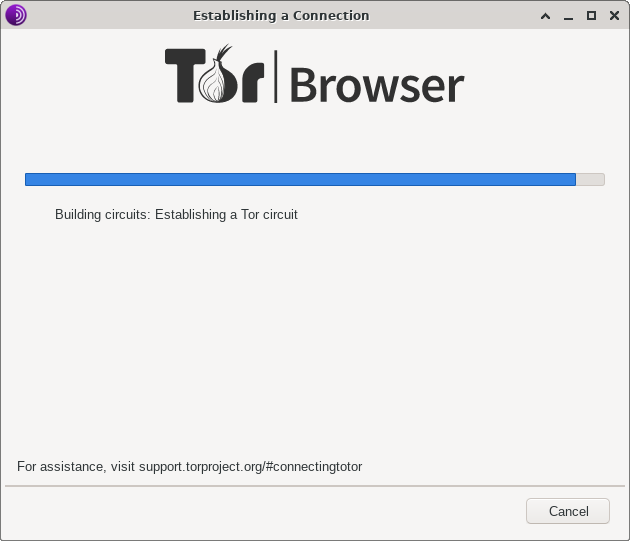

# 如何建立和配置安全的工作環境 (I)

[戡亂復國](mailto:rebuild-roc@ctemplar.com)

**內容提要：**

    本文概略地介紹如何通過兩臺計算機（或虛擬機）構建一個計算機工作環境，以避免
    把自己的個人信息和蹤跡暴露給中共當局。在這其中，有許多技術細節不會展開，這
    是為了讓讀者有一個總體的把握。有很多細節可以參考編程隨想的博客。

---
> 本文是[《如何建立和配置安全的工作環境 (II)》](single-vm.md)的姐妹篇，為了減小
讀者的閱讀負擔，我把這兩篇文章當成兩篇獨立的文章，讀者可以根據自己的具體情形
選擇其中之一來閱讀，所以，兩篇文章中有很多內容相互重複，為的就是不需要讀者把兩篇
文章都拿來閱讀。
---

我們的[平亂行動](../../principles/outline.md)是一個**匿蹤和公開** (anonymous &
open) 的行動。在這篇文章里，我們不介紹如何公開合作，而只是介紹如何做到匿蹤。
在這裡，我把 anonymous 翻譯為「匿蹤」而不是通常的「匿名」，是為了強調，我們不但
要隱藏我們的真實姓名，還要隱藏我們的 IP 地址等一切可能暴露我們身份的蹤跡。

但是，要做到匿蹤，需要學習大量的 IT 知識。對大多數打算推翻中共的人來說，這樣做
會面臨着陡峭的學習曲線，所以，一定有很多人會望而卻步，質疑這樣做有沒有必要。
對此，我的回答很簡單：如果不想遭到中共迫害，靜下心來學點技術是值得的！

要做到匿縱，基本的手段就是暗網工具（例如 [Tor](https://www.torproject.org)
和 [I2P](https://geti2p.net) 等）和專用於此目的的計算機系統。以匿蹤和公開的方式
反對中共，[編程隨想](https://program-think.blogspot.com/)可稱得上是這方面的
教父級人物，他/她已經安全活動了十餘年。筆者在比特幣出現後，就構思了以數位貨幣
打垮中共的方案，但是苦於不清楚如何避免中共追查，這時候，偶然看到了編程隨想的
博客，於是整個方案就通了。我說這些的目的，就是告訴讀者多去讀[編程隨想的相關
文章](https://program-think.blogspot.com/2010/04/howto-cover-your-tracks-0.html)[1]，
我的很多知識也是從他/她那裡了解到的，連我自己也不能保證我的每句話都是正確的。
總之，**沒有人能夠保證您的安全，請時刻記住，風險自負。**

## 一、虛擬與現實

為了做到匿蹤，我們需要有一個專用的計算機系統。這裡說的「專用的計算機系統」，
* 最好的情況是計算機的硬件和軟件都是為匿蹤而專用的；
* 次之的情況是計算機的硬件不是專用的，但其操作系統是為匿蹤而專用的；
* 再次之，而且是**很容易出問題**的情況是，計算機硬件和操作系統都不是專用的，但
  操作系統中有一個用戶賬號是為匿蹤專用的；
* 最次之，而且**幾乎百分之百要出問題**的情況是，從計算機硬件到操作系統再到用戶
  賬號，沒有一項是為匿蹤而專用的。


要做到第一種情況有兩種方式：
(1) 用幾台老舊的（不缺錢的話當然可以用全新的）計算機，在每台計算機上重新安裝
合適的操作系統（例如，在老舊的計算機中安裝最新版的 Windows 系統顯然不太靠譜，
但是有很多 Linux 發行版是專為老舊計算機設計的）；
(2) 在一台性能足夠好（主要是 CPU、內存和硬盤這三樣的性能）的計算機中建立虛擬機。

採用第二種方式的話，計算機中的操作系統不需要重新安裝，相對於虛擬機而言，這台
計算機及其操作系統（即運行虛擬機軟件的那個操作系統）就是虛擬機的**宿主機**
(host)，相對地，虛擬機也常被叫做宿主機的**客戶機** (guest)。

宿主機和客戶機這種稱謂更多地是用於修飾操作系統：在真實計算機中運行的操作系統
名為**宿主機操作系統** (host operating system, host OS)，在虛擬機中運行的操作
系統名為**客戶機操作系統** (guest operating system, guest oS)。
但是，從哲學的角度看，這種劃分有些武斷和狹隘。
虛擬機是在宿主機中使用軟件方法或硬件方法或軟硬件兼具的方法模擬出來的一個個計算機
硬件系統，真實的計算機所能擁有的硬件在虛擬機中也都具備。而且，只要是在同一個
宿主機中用同一種方式（比如用同一個虛擬機軟件）虛擬出來的幾臺虛擬機，和現實中的
計算機一樣，我們既可以把它們相互聯網，也可以彼此隔離。對於這些細節，在此我們不作
詳細介紹，讀者可參看維基百科
中的 [Virtual machine](https://en.wikipedia.org/wiki/Virtual_machine)（牆內的
讀者需要翻牆才能看到）。總之，**從客戶機的操作系統這個角度去看，它很難（或者說
不可能）分辨自己是運行於一台虛擬機中還是運行於一台真實的計算機中。**
另外，從理論上說，在一個客戶機操作系統中還可以運行着虛擬機軟件，而後者又會模擬
出虛擬機。雖然虛擬機中又產生虛擬機的這個嵌套過程不能無限進行下去，但是，進行有限
的很多次嵌套虛擬還是可以的。從這個角度上說，宿主機操作系統未必就一定運行在真實的
計算機硬件中。

所以，這就引出了一個宗教和哲學層面的問題：我們人類能不能分辨出，我們賴以存身的
這個世界究竟是真實的，抑或某臺超級計算機或某個超級精神虛擬出來的？或者，我們這樣
問：什麼是真實？什麼是虛擬？有絕對的真實與絕對的虛擬嗎？在某種意義上，佛教經典
就已經觸及和回答了這樣的問題。從這些問題的探討就可以看到，
**共產黨所灌輸的唯物主義有多麼冒失，它所宣揚的無神論（無論共產黨人真信還是假信）
有多麼缺乏憑據。可見，中共打壓宗教，拔高馬克思和恩格斯的哲學觀點而貶低其他哲學
觀點，這本身就是淺薄的夜郎自大和無知無畏。**
這個問題我們暫時打住，以後可能會另文討論。

基於以上討論，當我們不涉及技術層面的時候，其實不需要區分虛擬機和真實的計算機。
換句話說，我們的很多表述對於前面說的兩種方式都是適用的。


## 二、場景描述

我們的工作環境是這樣的：
* 我們有一台計算機（包括它的操作系統和各種必要軟件），用於編輯文檔、版本控制、與
  [GitHub](https://github.com) 和 [GitLab](https://gitlab.com) 交換信息，收發
  email 等等。不管它是真實的計算機還是一台
  虛擬機，在配置它的操作系統時其實沒有多大區別。我們把它叫做**工作平臺**。
* 我們還有一台計算機（同樣包括它的操作系統和各種必要軟件），用於掩護我們的工作
  平臺，幫助我們聯網、翻牆（牆外的用戶不需要）等等。它和我們的工作平台同為
  真實計算機或同為虛擬機，而且，對於虛擬機的情形，要求**它和工作平臺是用同一個
  虛擬機軟件（或者硬件，但一般人不具備這個條件）虛擬出來的。**
  不管它是真實的計算機還是虛擬機，在配置其操作系統時沒有區別。我們稱它為**前端
  平臺**。
* 前端平臺有兩張網卡，其中一張網卡通向互聯網，我們把它叫做**外網網卡**；另一張
  網卡只用於連接局域網，我們把這個局域網叫做**內部網絡**（簡稱內網），把連接
  內網的網卡叫做**內網網卡**。工作平臺只有一張網卡，這張網卡和前端平臺的內網網卡
  連接在同一個局域網中，即我們所說的內部網絡。內部網絡中不再有其他的主機。

我們把以上所描述的整個系統叫做我們的**工作環境**。

如果這個工作環境是用真實計算機實現的，則前端平臺的內網網卡和工作平臺的網卡可以
用一根網線直接相連，也可以把這兩個網卡分別用一根網線連接到一個集線器 (Ethernet
hub) 或網路交換機 (network switch) 或路由器 (router) 上（以下以集線器代表），而
集線器不能直接通往互聯網。要注意的是，市面上見到的大多數網線（指的是製作好可以
直接插入插槽的網線，兩端各帶一個水晶頭，即 RJ45 插頭）是用於連接網卡和集線器插槽
的。如果我們把這根網線的兩個水晶頭放在一起比較，會發現其中八根線的排列次序是相同
的（可以根據線的顏色辨別）。這種網線叫做**直連網線** (straight through Ethernet
cable 或 conventional Ethernet cable)。
兩台比較新的計算機可以用直連網線相互連接，也就是說，把一根直連網線的一個水晶頭
插入工作平臺的網卡，把另一個水晶頭插入前端平臺的內網網卡。
如果連接後這兩台計算機不能構成局域網，就要考慮換另一種網線了——把網線的兩個水晶頭
放在一起進行比較，會發現其中八根線的排列次序不相同。這種網線的名稱是**交叉網線**
(crossover Ethernet cable)。如果兩臺計算機用一條網線直接相連，中間不經過集線器
之類的設備，我建議還是選用交叉網線比較保險。比較老舊的兩臺計算機直接相連的時候，
可能必須要用交叉網線。

如果自己有工具、一段長度合適的網線和兩枚水晶頭，可以自行製作交叉網線或直連網線。
我們推薦一篇製作網線的英文文章
[*Making Ethernet Cables - Simple and Easy*](https://www.groundcontrol.com/galileo/ch5-ethernet.htm)
[2]，其中有圖片可以參考。
我們在此沒有圖片，只用文字敘述一下交叉網線的製作方法：
* 水晶頭接線腳的編號規則。令水晶頭的插入方向朝天，把帶有卡簧的一面遠離自己，
  把水晶頭接線腳裸露的一面朝向自己，把八個接線腳從左向右依次編號為 1 號腳、2
  號腳、……、8 號腳。我們把網線兩端的兩個水晶頭分別命名為甲和乙，它們的接線腳
  都按上述法則編號。
* 如果是製作直連網線，則把水晶頭甲和乙的編號相同的接線腳分別相連，也就是說，
  把水晶頭甲的 1 號腳和水晶頭乙的 1 號腳相連，把水晶頭甲的 2 號腳和水晶頭乙的
  2 號腳相連，等等。
* 如果是製作交叉網線，則把水晶頭甲的 1 號腳和 3 號腳分別與水晶頭乙的 3 號腳和
  1 號腳相連，把水晶頭甲的 2 號腳和 6 號腳分別與水晶頭乙的 6 號腳和 2 號腳相連，
  其餘的接線腳則依照編號相連，即，水晶頭甲的 4、5、7、8 號腳分別與水晶頭乙的
  4、5、7、8 號腳相連。

如果您的工作環境是用虛擬機實現的，那麼前端平臺和工作平臺的網線連接需要在宿主機
中配置。具體配置方法會因為虛擬機軟件的不同而不同，有些虛擬機軟件（例如
[VirtualBox](https://www.virtualbox.org/)）可以通過虛擬機軟件的圖形界面來配置，
有些虛擬機軟件（例如 [qemu](https://www.qemu.org)）則完全依靠命令行中的選擇項
來配置。當然，VirtualBox 也可以通過命令行來配置。

關於 VirtualBox，[VMware](https://www.vmware.com) 和 qemu 的使用與配置方法，
本文不打算介紹。**我們徵集這方面的文章或文章匯編。**


## 三、前端平臺的配置

前端平臺要做到如下事項：
* 幫助工作平臺翻牆和匿蹤，也就是要運行翻牆軟件和 Tor；
* 阻止工作平臺直接聯網——如果工作平臺不通過前端平臺中運行的 Tor，是無法
  連接到互聯網上的。換句話說，不能把前端平臺配置為網關——除非您有能力把前端平臺
  配置得像 [Whonix Gateway](https://www.whonix.org/wiki/VirtualBox/XFCE) 那樣。
* 前端平臺把工作平臺保護在 Tor 網絡之後，即，[Tor
  瀏覽器](https://www.torproject.org/download)運行在前端平臺中，
  工作平臺中的一切網絡聯繫都只能通過 Tor 網絡進行，以實現匿蹤。

這就是我們配置前端平臺的目標。

### 3.0 翻牆方法

所謂「翻牆」，就是突破中共當局對互聯網的封鎖和阻擋，訪問正常聯網情況下不能訪問
的網址。要想翻牆，就必須藉助於專門的軟件，就是俗稱的「翻牆軟件」。

翻牆軟件的種類繁多、原理各異，我們在此不打算一一講述。我只在此說幾點：
1. Unix/Linux 系統中能夠翻牆的軟件比較少，基本上，除了
  [Tor](https://www.torproject.org), [I2P](https://geti2p.net) 和
  [shadowsocks](https://shadowsocks.org/en/index.html) 等少數幾個軟件外，其餘
  軟件或者不支持 Unix/Linux 系統，或者被中共的防火牆封鎖。但是，對於完成平亂行動
  的各項任務而言，以上翻牆軟件足以勝任。
2. 相比之下，Windows 系統中可以翻牆的軟件就比較多了，所以，把運行翻牆軟件的操作
  系統選為 Windows 是一個不錯的選擇。不過，因為平亂行動更看重的是安全，我本人
  覺得，這其實並不如第一個方案好。
3. Android 系統下的翻牆軟件比 Windows 系統多得多。
4. 現在網上流行很多軟路由教程，可以在網關一側安裝翻牆軟件，這樣的話，儘量把工作
  環境中各個主機的操作系統選為 Unix/Linux 為好。

### 3.1 前端平臺是 Whonix Gateway 的情形

因為目前 [Whonix Gateway](https://www.whonix.org/wiki/VirtualBox/XFCE)
僅支持虛擬機，以它為前端平臺，則工作平臺也必須是虛擬機。

Whonix Gateway 的設計思想最重要的一點是：它會啟動匿蹤軟件 Tor，並迫使內部網絡中
的工作平臺必須通過它所運行的 Tor 才能聯網，否則就會被 Whonix Gateway 阻止。
這樣，工作平臺的真實 IP 地址就難以追查了（對中共當局而言，是不可追查）。

如果宿主機中運行着一個翻牆軟件，或者您在網上有個代理服務器可用，則 Whonix
Gateway 中的 Tor 應該通過翻牆軟件或代理服務器連接到 Tor 網絡中。具體步驟如下：

1. 啟動 Whonix Gateway 後，在 Whonix Gateway 桌面的右下角有一個鐘錶樣的圖標，
  即「Time Synchronization Monitor」，在這個圖標上用鼠標右鍵打開菜單，點擊「Tor
  control panel」；
2. 在彈出的 Tor 控制面板（tor-control-panel）上點擊「configure」；
3. 如果宿主機中運行着翻牆軟件，則在「Bridges type:」那裡選擇「None」，在「Proxy
  type:」那裡從「HTTP/HTTPS」、「SOCKS4」和「SOCKS5」中，根據翻牆軟件所提供的
  說明選擇其中一個，然後在「Address:」中填寫「10.0.2.15」，在「Port:」中填寫
  翻牆軟件的監聽端口——翻牆軟件的監聽端口及其類型各有不同，有些軟件還容許用戶
  自行配置，在此恕難一一列舉；
4. 如果您的主機中沒有安裝翻牆軟件，但是您在牆外擁有一個代理服務器，則步驟和步驟
  3 類似，只要把「Address:」後面的 IP 地址改為代理服務器的 IP 地址即可——在這種
  情況下，代理服務器通常需要您提供用戶名和口令，把它們分別填寫到「User:」
  和「Password:」那裡即可。
5. 如果以上兩種情況都不是，則在「Bridges type:」那裡選擇「meek-zure (works in
  China)」，在「Proxy type:」那裡選擇「None」。
6. 上述配置完成後，點擊「Accept」，則控制面板上的「Tor status」進度條會顯示連接
  Tor 網絡的進度。如果長時間連接不上，可以點擊控制面板上的「Restart Tor」試試。
  如果總是不行，就只能更換翻牆軟件或者代理服務器了。


作為前端虛擬機的 Whonix Gateway 工作良好時，原則上不需要在工作虛擬機中再安裝
Tor 瀏覽器，也就是說，可以「裸奔」，因為 Whonix Gateway 在保護它。但是，這其中
是否有風險，誰都不能保證（包括 Whonix Gateway 的製作者）。
所以，為保險起見，最好避免步驟 5 中的情形出現。

### 3.2 前端平臺不是 Whonix Gateway 的情形

在這種情形下，前端平臺和工作平臺既可以是真實機器，也可以是虛擬機。為安全着想，
我建議，**千萬不要把前端平臺配置為網關。**
我們可以這樣測試這一點：把工作平臺的網關設置為前端平臺內網網卡的 IP 地址（我們
把這種設置形象地說成工作平臺「裸奔上網」），如果工作平臺無法與互聯網連接，就說明
我們沒有把前端平臺配置為網關，或者沒有成功地把它配置為網關。

**測試完畢後，一定記住把工作平臺的網關設置為沒有。**
也就是說，把工作平臺的網關 IP 地址空着不填。

在前端平臺中安裝普通的翻牆軟件（例如各種 VPN 客戶端，SSR，v2ray 等等）和
[Tor 瀏覽器](https://www.torproject.org/download)，然後安裝一個軟件
[privoxy](https://www.privoxy.org) 或其他類似軟件，並令其監聽內網的某個
端口（privoxy 默認的監聽端口是 8118），如果沒有必要，不必更改。

privoxy 能夠監聽一些特定的 TCP 端口，然後把該端口接收到的包 (package) 轉發到某個
代理。在這裡，我們要求 privoxy 把來自監聽端口的包轉發到 Tor 的監聽端口
127.0.0.1:9150。如果前端平臺中的翻牆軟件有能力直接監聽其內網網卡的某個端口，就
不需要使用 privoxy 了。該軟件可以運行在 Windows 系統和 Linux 系統中，其配置方法
見編程隨想所寫的[《如何用 privoxy
輔助翻牆？》](https://program-think.blogspot.com/2014/12/gfw-privoxy.html)[3]。
如果不使用 privoxy，則可以參考編程隨想的另一篇文章[《多臺電腦如何共享翻牆通道
——兼談端口轉發的幾種方法》](https://program-think.blogspot.com/2013/01/cross-host-use-gfw-tool.html)[4]。

我們所構想的前端平臺是這樣的：
* Tor 瀏覽器運行在前端平臺中，而且 Tor 以前端平臺內的其他翻牆軟件為代理；
* privoxy 把來自監聽端口的連接轉發給 Tor；
* 工作平臺中的一切網絡連接都要以 privoxy 的監聽網址和監聽端口為代理。當工作平臺
  為 Linux 時，可以分為兩類來處理：
  * 如果工作平臺中的某個軟件支持 SOCKS5 時，把 SOCKS5 的網址和端口分別設置為
    privoxy 的監聽網址和監聽端口；
  * 如果不是上一種情形，則需要用 torsocks 來啟動該軟件，而工作平臺的 Linux 系統
    中的文件 `/etc/tor/torsocks.conf` 內應當含有如下兩行：
    ```
    TorAddress xxx.xxx.xxx.xxx
    TorPort yyyy
    ```
    其中 `xxx.xxx.xxx.xxx` 和 `yyyy` 分別是前端平臺內 privoxy 的監聽網址和
    監聽端口。

在有些情形中，privoxy 向 Tor 轉發可能工作得不是太好，這時我們被迫讓工作平臺運行
Tor 瀏覽器。在這種情形下，
* 前端平臺運行翻牆軟件和 privoxy，後者監聽內部網絡的端口 8118（如果在配置文件中
  改了，以改動後的端口為準），把來自該網址-端口的連接轉發給翻牆軟件；
* 工作平臺內運行 Tor 瀏覽器，它以前端平臺內 privoxy 的監聽網址-端口為代理連接到
  Tor 網絡中；
* 工作平臺內的其他網絡連接都要通過 Tor 進行：Tor 的監聽網址為 127.0.0.1，監聽
  端口為 9150。工作平臺內一個軟件要連接網絡時，可以通過配置它的代理，或者通過
  torsocks 啟動它，方法見上面 Tor 瀏覽器運行於前端平臺的情形。

無論上述兩種情形中的哪一種，Tor 瀏覽器的代理設置都是相似的，方法如下：
1. 當 Tor 瀏覽器剛剛啟動時，一旦看到下圖的界面就點擊 "Cancel" 按鈕；

    

2. 如果看到了下面的界面，則點擊其中的 "Configure" 按鈕；

    

3. 在下圖所示的界面內，不要勾選 "Tor is censored in my country"，而是勾選
  "I use a proxy to connect to the Internet"，然後在 "Proxy Type" 中選擇合適的
  類型（要依據翻牆軟件所提供的代理類型），在 "Address" 後填寫 Tor 所使用的代理的
  IP 地址（如果 Tor 瀏覽器運行在前端平臺內，此處為 127.0.0.1；如果在工作平臺內，
  此處為前端平臺內 privoxy 的監聽網址），在 "Port" 後面填寫 Tor 所使用的代理的
  監聽端口（如果 Tor 運行在前端平臺內，此處為翻牆軟件的監聽端口；如果在工作平臺
  內，此處為前端平臺內 privoxy 的監聽端口）。

    

4. 上述工作完成後，點擊右下角的 "Connect" 按鈕，靜候結果，如果聯網失敗，則需要
  根據出錯信息逐步排除整個配置中的錯誤。配置錯誤可能發生在前端平臺中，可能發生在
  工作平臺中（如果 Tor 瀏覽器運行在工作平臺內）。


## 四、工作平臺的配置

我們在此只考慮一個情形：工作平臺的操作系統某個是 Unix 或 Linux 發行版。有以下
幾點理由使我們選擇 Unix 系統或 Linux 系統——
* Unix/Linux 系統高度可配置、高度可控，因而容易達到更高的安全性；
* Unix/Linux 發行版自身帶有足夠的工具使我們很好地完成平亂行動的各項工作；
* Unix/Linux 發行版自身帶有很多強悍的工具，例如 `dd`, LUKS, LVM, `hexedit`,
  `shred` 等等，如果運用好的話，除非中共當局突然襲擊，除非對您使用酷刑或駭客
  手段，否則他們在您的計算機內根本就找不到用於指控您的證據。
* 強大的用戶社區和豐富的技術資料，遇到問題時可以尋求幫助。

我們在這裡只選擇 Linux 系統，但是絕大多數時候，Linux 系統和 Unix 系統是基本相同
的。

### 4.0 改變環境變量 HISTFILE 的值

在 Unix/Linux 系統的每一個 shell 中都會記錄用戶在該 shell 中所發出的指令。
大多數 Linux 系統默認的 shell 是 `bash`。在 `bash` 中，用戶的指令會被記錄於該
用戶的主目錄（可以用字符 `~` 代表）下的隱藏文件 `.bash_history` 中。在工作平臺
中，用戶指令不能留存記錄，否則一旦中共當局找上門來，就可以從這些記錄中得到線索。
為此，我們需要把記錄用戶指令的文件改為 `/dev/null`，這樣，當用戶退出 `bash` 時，
用戶所發布的指令都會寫入「黑洞」文件 `/dev/null` 中。有這樣幾個方案可供選擇：
* 在您的普通用戶主目錄下的文件 `.bashrc` 的尾部體添加一行
    ```
    export HISTFILE=/dev/null
    ```
    同時，把文件 `/root/.bashrc` 的尾部也添加如上一行。
* 把系統文件 `/etc/bashrc` 的尾部添加如上一行，並確認您的 `~/.bashrc` 以及
    `/root/.bashrc` 中都有一行
    ```
    source /etc/bashrc
    ```
    或者
    ```
    . /etc/bashrc
    ```

對於其他 shell，方法也是類似的。

### 4.1 torsocks 的配置

因為各種 Linux 發行版的軟件包管理和安裝軟件各不相同，我們不一一列舉如何安裝
torsocks。

在工作平臺上安裝了 torsocks 之後，可以在目錄 `/etc/tor` 下找到它的配置文件
`torsocks.conf`。如果找不到，可以使用軟件包管理工具查詢，或者使用
```
$ man torsocks
```
查看其配置文件的文件名以及路徑，或者使用命令
```
$ find / -name "torsocks.conf"
```
全局搜索；如果還找不到，可以試試
```
$ find / -name "torsocks*"
```

以下假設 torsocks 的配置文件為 `/etc/tor/torsocks.conf`，則在其中找到這樣兩行
```
TorAddress 127.0.0.1
TorPort 9050
```
也許是被注釋掉的這樣兩行：
```
#TorAddress 127.0.0.1
#TorPort 9050
```
無論如何，我們把這兩行改為
```
TorAddress xxx.xxx.xxx.xxx
TorPort yyyy
```
如果 Tor 瀏覽器是在工作平臺上運行的，則上面的 `xxx.xxx.xxx.xxx` 是 127.0.0.1，
`yyyy` 是 9150；如果 Tor 瀏覽器是在前端平臺上運行的，則 `xxx.xxx.xxx.xxx` 和
`yyyy` 分別是 privoxy 的監聽網址和監聽端口（由 privoxy 轉發給前端平臺上運行的
Tor）。


### 4.2 致命信息的隱藏

隨後的幾個小節中都會涉及一些致命信息。我們這裡所說的**致命信息**，是指存儲於
計算機文件內的一些信息，這些信息能夠把操作系統帳號與平亂行動中的角色聯繫在一起，
從而構成中共當局指控的證據。這些致命信息
* 有些是計算機用戶自己產生的，例如用戶所撰寫的文章或編制的軟件；
* 有些是用戶使用軟件時由軟件留下的，例如用戶使用瀏覽器上網時留下的各種記錄、
  cookie 等等。

總之，致命信息林林總總，很難掌控。但是，在 Unix/Linux 系統中，軟件都有固定的
配置目錄和記錄文件，而其操作系統、桌面系統和應用軟件之間都有明確的界限，不像
Windows 系統那樣含混不清，所以，只要
* 我們把相關軟件的配置文件（或目錄）以及記錄文件全部收集到一個統一的加密盤中，
* 然後在不工作時把加密盤隱匿起來，

就可以很好地隱匿致命信息了。我們下面幾個小節就是要講解哪些軟件的相關文件和目錄
需要放置到統一的加密盤中。至於如何隱匿加密盤，我們將在[《如何在 Linux
系統中隱藏致命信息》](hiding_fs.md)裡面專門討論。

能夠製作加密盤的軟件有很多，具體的工作方式也不盡相同，但還是有一些共性。我們這裡
要考慮的這類軟件都有這樣一些共性：
1. 把加密後的信息存儲於一個設備（例如硬盤或 U 盤，或其中的某個分區），或者存儲於
  一個普通文件——這些設備或文件就是我們下面所說的**加密盤**；
2. 加密盤中的信息被解密後，呈現為一個存儲設備（在 Unix/Linux 系統中叫做塊設
  備），對於用戶和操作系統來說，就像一個硬盤分區一樣，用戶可以在上面創建各種
  個樣的文件系統（用 Windows 用戶的說法，就是對它作「格式化」）；
3. 創建完文件系統之後，可以把它掛載在某個空的目錄（叫做**掛載點**）上，然後用戶
  就可以在這個目錄中進行通常的文件操作，而製作加密盤的軟件則在後台同步地把這些
  操作的結果加密後記錄在加密盤中；
4. 把上述文件系統卸載（類似於 Windows 系統中的「彈出」光盤或 U 盤）和關閉之後，
  第 2 點中所呈現出來的塊設備就消失了，所有的信息都以加密的形式存儲於加密盤中。

如何進行上述操作，以及如何隱藏加密盤，是[《如何在 Linux
系統中隱藏致命信息》](hiding_fs.md)所要討論的，本文只討論哪些信息
必須要存儲於加密盤中，也就是把相關的文件和目錄移送到上述第 3 點中所說的掛載點
中。

在下文中，為了簡潔，我們把第 3 點中所說的狀態表述為「把加密盤解密後掛載於某某
目錄上」。

### 4.3 gnupg 的配置

[gnupg](https://www.gnupg.org) 在各個 Linux 發行版中應當是自帶的，不需要安裝。如果沒有安裝，同樣可以利用
該發行版的軟件包安裝工具來安裝，具體方法在此從略。

**我們這個平亂行動是以 [openPGP 密鑰](https://en.wikipedia.org/wiki/OpenPGP)來辨別參與者的。**
參與者的代號（化名）、在 GitHub 等網站上的用戶名、email 賬號等都可以隨時改變，
只要所用的 openPGP 密鑰不變，我們就可以把變化前和變化後的代號等等聯繫在一起。
openPGP 密鑰的管理和使用通常就是由 gnupg 這個軟件來完成的——當然有其他的軟件，但
都不夠普及，甚至還要收費。

基於上述約定，中共當局要抓捕平亂行動參與者時，肯定會把 openPGP 密鑰作為指控的
最重要依據。所以，**一定要用專用的 openPGP 密鑰參與平亂行動，不得把該密鑰用於
其他事務，以免令中共當局找到抓捕線索。**

在默認情形下，`gnupg` 會把 openPGP 密鑰及其配置文件保存在用戶主目錄的子目錄
`.gnupg` 中。所以，這個子目錄就含有致命信息，必須要把它移送到加密盤中，然後
在用戶主目錄下建立一個符號鏈接 `.gnupg` 使之指向加密盤中 `.gnupg` 的實際位置。
舉個例子：假設我們用 [VeraCrypt](https://www.veracrypt.fr) 這個軟件製作和管理
加密盤，通常它把加密盤解密後會掛裝在 `/media/veracrypt1` 這個位置上。假設我們
把 gnupg 的配置目錄 `.gnupg` 移送到 `/media/veracrypt1` 中成為它下面的子目錄
`/gnupg`，則用命令
```
$ ln -sf /media/veracrypt1/gnupg ~/.gnupg
```
建立這個符號鏈接。如果建立了符號鏈接，則必須記得：**關閉加密盤後，要刪除上述
符號鏈接。對於以後其他符號鏈接也是如此。**

如果不想這麼麻煩地建立和刪除符號鏈接，另外一種選擇是每次使用 `gpg` 命令時，都用
`gpg --homedir /media/veracrypt1/gnupg` 來替代 `gpg`。例如，用某個密鑰
`0x12345678` 加密某個文件 `explicit_file` 而形成密文文件 `encrypt_file` 時，通常
指令為
```
$ gpg -r 0x12345678 -o encrypt_file -e explicit_file
```
但是現在要變成
```
$ gpg --homedir /media/veracrypt1/gnupg -r 0x12345678 -o encrypt_file -e explicit_file
```

至於產生、管理以及使用 openPGP 密鑰的方法，我們將專文敘述。

**一定要記住，向密鑰服務器傳送或者下載密鑰的時候，不能用 `gpg` 裸奔**，應當
* 用 `torsocks gpg` 來替代命令行中的 `gpg`，或者
* 通過瀏覽器（以 Tor 為代理）進行。

### 4.4 SSH 客戶端的配置

在 Unix/Linux 系統中，SSH 客戶端軟件的名稱就是 `ssh`，它的配置目錄通常就是用戶
主目錄下的 `.ssh`，其中含有用戶的 SSH 會話密鑰等，也是致命信息。和 `.gnupg`
這個子目錄的處理一樣，我們把它移送到加密盤中，並且在用戶主目錄下建立符號鏈接
`.ssh` 指向加密盤中的配置目錄。**在不工作時同樣要記得刪除這個符號鏈接。**

### 4.5 瀏覽器的配置

#### 4.5.1 下載與驗證

對於瀏覽器，我們建議採用 firefox，而且不能下載牆內的版本（參看編程隨想
在[《基於安全性考慮，如何選擇及切換 Firefox
版本？》](https://program-think.blogspot.com/2018/10/How-to-Choose-Firefox-Version.html)中
所列理由，而且該文建議下載長期支持版本，而不是本段所說的最新發布版。我們在講完
發布版的下載和驗證之後，再簡略介紹如何得到長期支持版本及其驗證方法），而是從牆外
的 [mozilla FTP 站點](https://ftp.mozilla.org/pub/firefox/releases/)
尋找最新發布版的的版本號，例如
[72.0](https://ftp.mozilla.org/pub/firefox/releases/72.0/)，
點擊進入後再選擇合適的平臺，通常的 Linux 平臺都是
[linux-x86_64](https://ftp.mozilla.org/pub/firefox/releases/72.0/linux-x86_64/)，
點擊進入後再選擇合適的語言版本，我們建議選擇英文版的
[en-US](https://ftp.mozilla.org/pub/firefox/releases/72.0/linux-x86_64/en-US/)
等，而不要選擇簡體中文版的
[zh-CN](https://ftp.mozilla.org/pub/firefox/releases/72.0/linux-x86_64/zh-CN/)。
如果實在要選中文版的，可以考慮正體中文版的
[zh-TW](https://ftp.mozilla.org/pub/firefox/releases/72.0/linux-x86_64/zh-TW/)。
選定了語言版本後，點擊進入，會看到有兩個文件，一個是類似於
`firefox-72.0.tar.bz2` 這樣的文件（其中 `72.0` 為 firefox 的版本號），另一個比
剛才這個文件多一個後綴 `.asc`。
前一個文件是必須下載的，但是，為安全起見，帶後綴 `.asc` 的這個文件也要下載，它是
`firefox-72.0.tar.bz2` 這個文件的數位簽名，用於驗證 `firefox-72.0.tar.bz2`
的真偽。

下載完成後，把這兩個文件放在同一個目錄中，比如放置在 `~/Downloads` 下，則依次
執行
```
$ cd
$ cd Downolads
$ ls -tr
```
這會看到 `firefox-72.0.tar.bz2` 和 `firefox-72.0.tar.bz2.asc` 這兩個文件。接下來
執行
```
$ gpg --verify firefox-72.0.tar.bz2.asc
```
或（參看 4.3 小節）
```
$ gpg --homedir /media/veracrypt1/gnupg --verify firefox-72.0.tar.bz2.asc
```
以驗證 `firefox-72.0.tar.bz2` 的真偽。上述指令的結果有三種可能：
1. `gpg` 返回的信息為
    ```
    gpg: assuming signed data in 'firefox-72.0.tar.bz2'
    gpg: Signature made Fri 03 Jan 2020 01:08:28 PM EST
    gpg:                using RSA key 097B313077AE62A02F84DA4DF1A6668FBB7D572E
    gpg: Good signature from "Mozilla Software Releases <release@mozilla.com>" [unknown]
    gpg: WARNING: This key is not certified with a trusted signature!
    gpg:          There is no indication that the signature belongs to the owner.
    Primary key fingerprint: 14F2 6682 D091 6CDD 81E3  7B6D 61B7 B526 D98F 0353
         Subkey fingerprint: 097B 3130 77AE 62A0 2F84  DA4D F1A6 668F BB7D 572E
    ```
    請注意上面第四行和第五行的信息：第四行告訴我們，根據數位署名核對的結果，文件
    `firefox-72.0.tar.bz2` 是正確的，沒有被篡改過；第五、六行則告訴我們，簽署
    所用密鑰的可信任度是未知的，不能確定該密鑰的確如第四行所聲稱的那樣，是
    Mozilla 專門用戶軟件發布的簽署密鑰。也就是說，很可能出現這樣一種情況：某個
    欺騙者用它自己的密鑰冒充 Mozilla 軟件發布專用密鑰，並且用這個假密鑰為文件
    `firefox-72.0.tar.bz2` 作了簽署——其結果是，署名是真的，但是我們不知道署名人
    是不是真的。（想象一下，有個騙子聲稱自己是中共高幹子弟，和您簽署了合約，您
    知道合約的確是他簽署的，但不知道他本人是否是真的。這裡與此相似。）
    所以，最終結論依賴於密鑰的真偽。上述信息的最後兩行給出了密鑰的指紋
    (fingerprint)。這是鑑定密鑰的憑證，如果我們能夠找到 Mozilla 的人員當面核對
    這些指紋就可以確定密鑰的真偽，但是我們不能。不過，我本人通過歷次不同途徑
    下載（主要是通過 Tor 下載），通過各種網頁提供的指紋核對，從來沒有遇到假密鑰
    的提示，所以，該密鑰為真密鑰的概率很高。但是仍然不能最後確定——即使遇到了
    Mozilla 的人員，我們又怎麼確定其人真是 Mozilla 的人員呢？最後仍然是用概率來
    評估。這個實例就很好地體現了如何關於密鑰的「信任網」(web of trust) 的概念。
2. `gpg` 返回的結果是
    ```
    gpg: assuming signed data in 'firefox-72.0.tar.bz2'
    gpg: Signature made Fri 03 Jan 2020 01:08:28 PM EST
    gpg:                using RSA key 097B313077AE62A02F84DA4DF1A6668FBB7D572E
    gpg: BAD signature from "Mozilla Software Releases <release@mozilla.com>" [unknown]
    ```

    這就告訴我們，密鑰和被簽署文件 `firefox-72.0.tar.bz2` 中至少有一個是假的。
    我們用不着追究到底誰是假的，總之情況不對。不過，這也提示我們，在我們的
    `gpg` 的密鑰環中，指紋為 `097B313077AE62A02F84DA4DF1A6668FBB7D572E`
    （這種寫法和 `097B 3130 77AE 62A0 2F84 DA4D F1A6 668F BB7D 572E` 一樣，只
    不過後者是為了提高可讀性）的密鑰可能是假的。如果這個密鑰經常出現這種情況，
    我們有理由懷疑這個密鑰的真偽。
3. `gpg` 提示我們，我們的 `gpg` 密鑰環中沒有相應的密鑰。這需要我們到密鑰服務器
  上去下載該密鑰。這方面的知識此處從略，將來或許專文論述。


編程隨想在上面那篇文章中建議選擇長期支持版以策安全，而不是上面所說的最新發布版。
從網址 <https://www.mozilla.org/firefox/organizations/all/>
可以下載自己所需版本的壓縮包。在下載開始後，可以從瀏覽器的下載管理器那裡得到
壓縮包的網址 (URL)。把這個 URL 拷貝出來，在其最後加上 `.asc` 就可以得到該壓縮包
的數位署名的網址。把數位署名也下載下來，和壓縮包放在一起以便驗證。驗證方法和
上面的描述類似。

#### 4.5.2 安裝

我們這裡只說全局安裝。假設下載後的 `firefox-72.0.tar.bz2` 的絕對路徑是
`/home/username/Downloads/firefox-72.0.tar.bz2`，則安裝很簡單：以超級用戶身份
執行
```
# cd /usr/local/src
# tar -xjvf /home/username/Downloads/firefox-72.0.tar.bz2
# cd firefox
# ln -sf `pwd`/firefox /usr/local/bin/firefox
```

#### 4.5.3 廢止中共治下的證書

firefox 還保留着來自中共治下的證書。因為中共的不可信，這些證書也是不可信任的，
所以我們要把它們廢掉。廢掉的方法很多，我們這裡介紹的辦法是編輯證書所在的文件，
我們所用的主要工具是 `hexedit`，或者其他十六進制編輯器（如果沒有這類編輯器，
請設法安裝一個），方法如下：
```
# cd /usr/local/src/firefox
# hexedit libnssckbi.so
```

編輯器的界面如下：
```
00000000   7F 45 4C 46  02 01 01 00  00 00 00 00  00 00 00 00  .ELF............
00000010   03 00 3E 00  01 00 00 00  B0 E1 01 00  00 00 00 00  ..>.............
00000020   40 00 00 00  00 00 00 00  08 37 07 00  00 00 00 00  @........7......
00000030   00 00 00 00  40 00 38 00  09 00 40 00  20 00 1F 00  ....@.8...@. ...
00000040   01 00 00 00  04 00 00 00  00 00 00 00  00 00 00 00  ................
00000050   00 00 00 00  00 00 00 00  00 00 00 00  00 00 00 00  ................
00000060   80 99 00 00  00 00 00 00  80 99 00 00  00 00 00 00  ................
00000070   00 10 00 00  00 00 00 00  01 00 00 00  05 00 00 00  ................
00000080   1F 9E 00 00  00 00 00 00  1F DE 01 00  00 00 00 00  ................
00000090   1F DE 01 00  00 00 00 00  46 DD 00 00  00 00 00 00  ........F.......
000000A0   46 DD 00 00  00 00 00 00  00 10 00 00  00 00 00 00  F...............
000000B0   01 00 00 00  04 00 00 00  00 80 01 00  00 00 00 00  ................
000000C0   00 C0 02 00  00 00 00 00  00 C0 02 00  00 00 00 00  ................
000000D0   90 07 04 00  00 00 00 00  90 07 04 00  00 00 00 00  ................
000000E0   00 10 00 00  00 00 00 00  01 00 00 00  06 00 00 00  ................
000000F0   30 96 05 00  00 00 00 00  30 E6 06 00  00 00 00 00  0.......0.......
00000100   30 E6 06 00  00 00 00 00  48 9F 01 00  00 00 00 00  0.......H.......
00000110   68 9F 01 00  00 00 00 00  00 10 00 00  00 00 00 00  h...............
00000120   02 00 00 00  06 00 00 00  80 9D 06 00  00 00 00 00  ................
00000130   80 ED 07 00  00 00 00 00  80 ED 07 00  00 00 00 00  ................
00000140   50 02 00 00  00 00 00 00  50 02 00 00  00 00 00 00  P.......P.......
00000150   08 00 00 00  00 00 00 00  04 00 00 00  04 00 00 00  ................
00000160   38 02 00 00  00 00 00 00  38 02 00 00  00 00 00 00  8.......8.......
---  libnssckbi.so	 --0x0/0x73F08-----------------------------------------
```
界面中最下面的一行是狀態行（顯示編輯器和被編輯的狀態），其餘的都是編輯窗口。編輯
窗口的中間一欄（每行有 2 * 4 * 4 個十六進制數字）和右邊一欄（每行 16 個字符）是
被編輯文件的內容，這兩欄對應的是文件中同樣的內容，只不過中間一欄用十六進制數字
顯示，右邊一欄儘量用字符顯示（不能顯示的就用句點代替）。編輯窗口的左邊一欄為地址
欄，用十六進制數字顯示中間和右邊一欄中對應行第一個字節在文件中的位置（偏移，從 0
開始）。光標始終在編輯窗口的中間一欄或右邊一欄，可以用 `Tab` 鍵在這兩欄之間來回
切換。我們可以用鍵盤上的上下左右四個方向鍵移動光標，可以用上下翻頁鍵（分別標着
Page Up 和 Page Down）上下滾屏。

我們現在開始編輯。**用 `Tab` 鍵把光標切換到最右邊一欄**，然後按 `/` 鍵，表示
我們要搜索一個字符串。這時候編輯窗口出現提示如下：
```
00000000   7F 45 4C 46  02 01 01 00  00 00 00 00  00 00 00 00  .ELF............
00000010   03 00 3E 00  01 00 00 00  B0 E1 01 00  00 00 00 00  ..>.............
00000020   40 00 00 00  00 00 00 00  08 37 07 00  00 00 00 00  @........7......
00000030   00 00 00 00  40 00 38 00  09 00 40 00  20 00 1F 00  ....@.8...@. ...
00000040   01 00 00 00  04 00 00 00  00 00 00 00  00 00 00 00  ................
00000050   00 00 00 00  00 00 00 00  00 00 00 00  00 00 00 00  ................
00000060   80 99 00 00  00 00 00 00  80 99 00 00  00 00 00 00  ................
00000070   00 10 00 00  00 00 00 00  01 00 00 00  05 00 00 00  ................
00000080   1F 9E 00 00  00 00 00 00  1F DE 01 00  00 00 00 00  ................
00000090   1F DE 01 00  00 00 00 00  46 DD 00 00  00 00 00 00  ........F.......

                            Hexa string to search:

000000D0   90 07 04 00  00 00 00 00  90 07 04 00  00 00 00 00  ................
000000E0   00 10 00 00  00 00 00 00  01 00 00 00  06 00 00 00  ................
000000F0   30 96 05 00  00 00 00 00  30 E6 06 00  00 00 00 00  0.......0.......
00000100   30 E6 06 00  00 00 00 00  48 9F 01 00  00 00 00 00  0.......H.......
00000110   68 9F 01 00  00 00 00 00  00 10 00 00  00 00 00 00  h...............
00000120   02 00 00 00  06 00 00 00  80 9D 06 00  00 00 00 00  ................
00000130   80 ED 07 00  00 00 00 00  80 ED 07 00  00 00 00 00  ................
00000140   50 02 00 00  00 00 00 00  50 02 00 00  00 00 00 00  P.......P.......
00000150   08 00 00 00  00 00 00 00  04 00 00 00  04 00 00 00  ................
00000160   38 02 00 00  00 00 00 00  38 02 00 00  00 00 00 00  8.......8.......
---  libnssckbi.so	 --0x9B/0x73F08----------------------------------------
```
緊接着輸入我們所要尋找的字符串 `China` （要注意大小寫）並回車，則光標就會定位在
它所遇到的第一處 `China` 那裡，如下所示：
```
00024F80   03 55 04 03  13 29 45 6E  74 72 75 73  74 20 52 6F  .U...)Entrust Ro
00024F90   6F 74 20 43  65 72 74 69  66 69 63 61  74 69 6F 6E  ot Certification
00024FA0   20 41 75 74  68 6F 72 69  74 79 20 2D  20 47 32 00   Authority - G2.
00024FB0   02 04 4A 53  8C 28 00 8C  F4 27 FD 79  0C 3A D1 66  ..JS.(...'.y.:.f
00024FC0   06 8D E8 1E  57 EF BB 93  22 72 D4 00  4B E2 C9 91  ....W..."r..K...
00024FD0   96 65 0C F4  0E 5A 93 92  A0 0A FE B2  00 30 81 BF  .e...Z.......0..
00024FE0   31 0B 30 09  06 03 55 04  06 13 02 55  53 31 16 30  1.0...U....US1.0
00024FF0   14 06 03 55  04 0A 13 0D  45 6E 74 72  75 73 74 2C  ...U....Entrust,
00025000   20 49 6E 63  2E 31 28 30  26 06 03 55  04 0B 13 1F   Inc.1(0&..U....
00025010   53 65 65 20  77 77 77 2E  65 6E 74 72  75 73 74 2E  See www.entrust.
00025020   6E 65 74 2F  6C 65 67 61  6C 2D 74 65  72 6D 73 31  net/legal-terms1
00025030   39 30 37 06  03 55 04 0B  13 30 28 63  29 20 32 30  907..U...0(c) 20
00025040   31 32 20 45  6E 74 72 75  73 74 2C 20  49 6E 63 2E  12 Entrust, Inc.
00025050   20 2D 20 66  6F 72 20 61  75 74 68 6F  72 69 7A 65   - for authorize
00025060   64 20 75 73  65 20 6F 6E  6C 79 31 33  30 31 06 03  d use only1301..
00025070   55 04 03 13  2A 45 6E 74  72 75 73 74  20 52 6F 6F  U...*Entrust Roo
00025080   74 20 43 65  72 74 69 66  69 63 61 74  69 6F 6E 20  t Certification
00025090   41 75 74 68  6F 72 69 74  79 20 2D 20  45 43 31 00  Authority - EC1.
000250A0   20 D8 06 40  DF 9B 25 F5  12 25 3A 11  EA F7 59 8A   ..@..%..%:...Y.
000250B0   EB 14 B5 47  00 B6 7E 1D  F0 58 C5 49  6C 24 3B 3D  ...G..~..X.Il$;=
000250C0   ED 98 18 ED  BC 00 30 56  31 0B 30 09  06 03 55 04  ......0V1.0...U.
000250D0   06 13 02 43  4E 31 30 30  2E 06 03 55  04 0A 0C 27  ...CN100...U...'
000250E0   43 68 69 6E  61 20 46 69  6E 61 6E 63  69 61 6C 20  China Financial
---  libnssckbi.so	 --0x250E0/0x73F08-------------------------------------
```
我們隨便按五個字符（只要不構成字符串 "China" 即可），例如 `Chai8`，這就把剛才的
"China" 改成了 "Chai8"。如果願意，還可以把原 "China" 上面一行中的 "CN100" 改為
"ZH100" 等等。

把上述搜索 "China"-修改為 "Chai8" 的過程不斷循環，就可以把整個文件
`libnssckbi.so` 中的 "China" 都改成了 "Chai8"。在每次修改完、進行下一個搜索時，
`hexedit` 會詢問是否保存剛才的修改（注意看狀態行左邊的兩個星號，這表示文件被修改
過但尚未存盤），如下所示：
```
00024F80   03 55 04 03  13 29 45 6E  74 72 75 73  74 20 52 6F  .U...)Entrust Ro
00024F90   6F 74 20 43  65 72 74 69  66 69 63 61  74 69 6F 6E  ot Certification
00024FA0   20 41 75 74  68 6F 72 69  74 79 20 2D  20 47 32 00   Authority - G2.
00024FB0   02 04 4A 53  8C 28 00 8C  F4 27 FD 79  0C 3A D1 66  ..JS.(...'.y.:.f
00024FC0   06 8D E8 1E  57 EF BB 93  22 72 D4 00  4B E2 C9 91  ....W..."r..K...
00024FD0   96 65 0C F4  0E 5A 93 92  A0 0A FE B2  00 30 81 BF  .e...Z.......0..
00024FE0   31 0B 30 09  06 03 55 04  06 13 02 55  53 31 16 30  1.0...U....US1.0
00024FF0   14 06 03 55  04 0A 13 0D  45 6E 74 72  75 73 74 2C  ...U....Entrust,
00025000   20 49 6E 63  2E 31 28 30  26 06 03 55  04 0B 13 1F   Inc.1(0&..U....
00025010   53 65 65 20  77 77 77 2E  65 6E 74 72  75 73 74 2E  See www.entrust.

                         Save changes (Yes/No/Cancel) ?

00025050   20 2D 20 66  6F 72 20 61  75 74 68 6F  72 69 7A 65   - for authorize
00025060   64 20 75 73  65 20 6F 6E  6C 79 31 33  30 31 06 03  d use only1301..
00025070   55 04 03 13  2A 45 6E 74  72 75 73 74  20 52 6F 6F  U...*Entrust Roo
00025080   74 20 43 65  72 74 69 66  69 63 61 74  69 6F 6E 20  t Certification
00025090   41 75 74 68  6F 72 69 74  79 20 2D 20  45 43 31 00  Authority - EC1.
000250A0   20 D8 06 40  DF 9B 25 F5  12 25 3A 11  EA F7 59 8A   ..@..%..%:...Y.
000250B0   EB 14 B5 47  00 B6 7E 1D  F0 58 C5 49  6C 24 3B 3D  ...G..~..X.Il$;=
000250C0   ED 98 18 ED  BC 00 30 56  31 0B 30 09  06 03 55 04  ......0V1.0...U.
000250D0   06 13 02 43  4E 31 30 30  2E 06 03 55  04 0A 0C 27  ...CN100...U...'
000250E0   43 68 61 69  38 20 46 69  6E 61 6E 63  69 61 6C 20  Chai8 Financial
-**  libnssckbi.so	 --0x250E5/0x73F08-------------------------------------
```
輸入 `Y` 表示同意存盤。

到了某一處 "China" 那裡，在它上面第三行中還有一串數字 “291231”，如下所示：
```
00044ED0   04 04 03 02  01 06 30 0F  06 03 55 1D  13 01 01 FF  ......0...U.....
00044EE0   04 05 30 03  01 01 FF 30  1D 06 03 55  1D 0E 04 16  ..0....0...U....
00044EF0   04 14 B7 63  E7 1A DD 8D  E9 08 A6 55  83 A4 E0 6A  ...c.......U...j
00044F00   50 41 65 11  42 49 30 0A  06 08 2A 86  48 CE 3D 04  PAe.BI0...*.H.=.
00044F10   03 03 03 67  00 30 64 02  30 61 79 D8  E5 42 47 DF  ...g.0d.0ay..BG.
00044F20   1C AE 53 99  17 B6 6F 1C  7D E1 BF 11  94 D1 03 88  ..S...o.}.......
00044F30   75 E4 8D 89  A4 8A 77 46  DE 6D 61 EF  02 F5 FB B5  u.....wF.ma.....
00044F40   DF CC FE 4E  FF FE A9 E6  A7 02 30 5B  99 D7 85 37  ...N......0[...7
00044F50   06 B5 7B 08  FD EB 27 8B  4A 94 F9 E1  FA A7 8E 26  ..{...'.J......&
00044F60   08 E8 7C 92  68 6D 73 D8  6F 26 AC 21  02 B8 99 B7  ..|.hms.o&.!....
00044F70   26 41 5B 25  60 AE D0 48  1A EE 06 00  30 82 05 8D  &A[%`..H....0...
00044F80   30 82 03 75  A0 03 02 01  02 02 04 18  4A CC D6 30  0..u........J..0
00044F90   0D 06 09 2A  86 48 86 F7  0D 01 01 0B  05 00 30 56  ...*.H........0V
00044FA0   31 0B 30 09  06 03 55 04  06 13 02 5A  48 31 30 30  1.0...U....ZH100
00044FB0   2E 06 03 55  04 0A 0C 27  43 68 61 69  38 20 46 69  ...U...'Chai8 Fi
00044FC0   6E 61 6E 63  69 61 6C 20  43 65 72 74  69 66 69 63  nancial Certific
00044FD0   61 74 69 6F  6E 20 41 75  74 68 6F 72  69 74 79 31  ation Authority1
00044FE0   15 30 13 06  03 55 04 03  0C 0C 43 46  43 41 20 45  .0...U....CFCA E
00044FF0   56 20 52 4F  4F 54 30 1E  17 0D 31 32  30 38 30 38  V ROOT0...120808
00045000   30 33 30 37  30 31 5A 17  0D 32 39 31  32 33 31 30  030701Z..2912310
00045010   33 30 37 30  31 5A 30 56  31 0B 30 09  06 03 55 04  30701Z0V1.0...U.
00045020   06 13 02 43  4E 31 30 30  2E 06 03 55  04 0A 0C 27  ...CN100...U...'
00045030   43 68 69 6E  61 20 46 69  6E 61 6E 63  69 61 6C 20  China Financial
---  libnssckbi.so	 --0x45030/0x73F08-------------------------------------
```
這表示來自中共治下的這個證書的到期日為 2029 年 12 月 31 日，我們把其中表示年份的
"29" 改為 "19"，則因為 2019 年 12 月 31 日已過，僅憑這一點也可以廢掉這張證書。

等我們把所有的 "China" 都修改稱 "Chai8" 後，再搜索 "China" 就會得到如下所示的
信息：
```
00044ED0   04 04 03 02  01 06 30 0F  06 03 55 1D  13 01 01 FF  ......0...U.....
00044EE0   04 05 30 03  01 01 FF 30  1D 06 03 55  1D 0E 04 16  ..0....0...U....
00044EF0   04 14 B7 63  E7 1A DD 8D  E9 08 A6 55  83 A4 E0 6A  ...c.......U...j
00044F00   50 41 65 11  42 49 30 0A  06 08 2A 86  48 CE 3D 04  PAe.BI0...*.H.=.
00044F10   03 03 03 67  00 30 64 02  30 61 79 D8  E5 42 47 DF  ...g.0d.0ay..BG.
00044F20   1C AE 53 99  17 B6 6F 1C  7D E1 BF 11  94 D1 03 88  ..S...o.}.......
00044F30   75 E4 8D 89  A4 8A 77 46  DE 6D 61 EF  02 F5 FB B5  u.....wF.ma.....
00044F40   DF CC FE 4E  FF FE A9 E6  A7 02 30 5B  99 D7 85 37  ...N......0[...7
00044F50   06 B5 7B 08  FD EB 27 8B  4A 94 F9 E1  FA A7 8E 26  ..{...'.J......&

                                   not found
                                (press any key)

00044FA0   31 0B 30 09  06 03 55 04  06 13 02 5A  48 31 30 30  1.0...U....ZH100
00044FB0   2E 06 03 55  04 0A 0C 27  43 68 61 69  38 20 46 69  ...U...'Chai8 Fi
00044FC0   6E 61 6E 63  69 61 6C 20  43 65 72 74  69 66 69 63  nancial Certific
00044FD0   61 74 69 6F  6E 20 41 75  74 68 6F 72  69 74 79 31  ation Authority1
00044FE0   15 30 13 06  03 55 04 03  0C 0C 43 46  43 41 20 45  .0...U....CFCA E
00044FF0   56 20 52 4F  4F 54 30 1E  17 0D 31 32  30 38 30 38  V ROOT0...120808
00045000   30 33 30 37  30 31 5A 17  0D 31 39 31  32 33 31 30  030701Z..1912310
00045010   33 30 37 30  31 5A 30 56  31 0B 30 09  06 03 55 04  30701Z0V1.0...U.
00045020   06 13 02 5A  48 31 30 30  2E 06 03 55  04 0A 0C 27  ...ZH100...U...'
00045030   43 68 61 69  38 20 46 69  6E 61 6E 63  69 61 6C 20  Chai8 Financial
---  libnssckbi.so	 --0x4500A/0x73F08-------------------------------------
```
按照提示，我們隨便按一個鍵退出這個提示界面。現在我們打算回到文件的開頭，方法是
按下回車鍵。這時候 `hexedit` 詢問我們要去什麼位置，如下所示：
```
00044ED0   04 04 03 02  01 06 30 0F  06 03 55 1D  13 01 01 FF  ......0...U.....
00044EE0   04 05 30 03  01 01 FF 30  1D 06 03 55  1D 0E 04 16  ..0....0...U....
00044EF0   04 14 B7 63  E7 1A DD 8D  E9 08 A6 55  83 A4 E0 6A  ...c.......U...j
00044F00   50 41 65 11  42 49 30 0A  06 08 2A 86  48 CE 3D 04  PAe.BI0...*.H.=.
00044F10   03 03 03 67  00 30 64 02  30 61 79 D8  E5 42 47 DF  ...g.0d.0ay..BG.
00044F20   1C AE 53 99  17 B6 6F 1C  7D E1 BF 11  94 D1 03 88  ..S...o.}.......
00044F30   75 E4 8D 89  A4 8A 77 46  DE 6D 61 EF  02 F5 FB B5  u.....wF.ma.....
00044F40   DF CC FE 4E  FF FE A9 E6  A7 02 30 5B  99 D7 85 37  ...N......0[...7
00044F50   06 B5 7B 08  FD EB 27 8B  4A 94 F9 E1  FA A7 8E 26  ..{...'.J......&
00044F60   08 E8 7C 92  68 6D 73 D8  6F 26 AC 21  02 B8 99 B7  ..|.hms.o&.!....

                                New position ? 0x

00044FA0   31 0B 30 09  06 03 55 04  06 13 02 5A  48 31 30 30  1.0...U....ZH100
00044FB0   2E 06 03 55  04 0A 0C 27  43 68 61 69  38 20 46 69  ...U...'Chai8 Fi
00044FC0   6E 61 6E 63  69 61 6C 20  43 65 72 74  69 66 69 63  nancial Certific
00044FD0   61 74 69 6F  6E 20 41 75  74 68 6F 72  69 74 79 31  ation Authority1
00044FE0   15 30 13 06  03 55 04 03  0C 0C 43 46  43 41 20 45  .0...U....CFCA E
00044FF0   56 20 52 4F  4F 54 30 1E  17 0D 31 32  30 38 30 38  V ROOT0...120808
00045000   30 33 30 37  30 31 5A 17  0D 31 39 31  32 33 31 30  030701Z..1912310
00045010   33 30 37 30  31 5A 30 56  31 0B 30 09  06 03 55 04  30701Z0V1.0...U.
00045020   06 13 02 5A  48 31 30 30  2E 06 03 55  04 0A 0C 27  ...ZH100...U...'
00045030   43 68 61 69  38 20 46 69  6E 61 6E 63  69 61 6C 20  Chai8 Financial
---  libnssckbi.so	 --0x4500A/0x73F08-------------------------------------
```
這時我們輸入 "0" 並且回車，就回到了文件的開頭。

按照前面搜索和修改 "China" 的方法，我們修改文件中的字符串 “GUANG DONG"，把它改為
別的字符串，例如 "KUANG TUNG"。此外，把某處 "GUANG DONG" 上方第三行中的 "401231"
（表示該證書的有效期持續至 2040 年 12 月 31 日）改為 "191231"。
當所有這些工作完成後，按 `Ctrl-c` （按住 `Ctrl` 鍵的同時再按 `c` 鍵）退出編輯。

至此，我們就把 firefox 中所攜帶的中共治下的證書廢掉了。可能還有其他證書也是中共
管控的，希望了解情況的朋友前來告訴我們。截至目前，來自香港的證書我們沒有動。

#### 4.5.4 隱藏 ForeFox 的配置目錄

瀏覽器能夠留存用戶的很多上網習慣和痕跡，所以必須隱藏。`firefox` 的所有配置文件
以及記錄文件都在用戶著目錄的子目錄 `.mozilla` 中，只要把它移送到加密盤中，然後
在用戶主目錄下建立符號鏈接 `.mozilla` 使之指向加密盤中的真實配置目錄即可。**用戶
不工作時應當記得把這個符號鏈接刪除。**

#### 4.5.5 設置 FireFox 的代理

1. 在完成 4.5.4 中的隱藏和建立符號鏈接後，在設置之前，運行 `firefox` 一次，隨即
  關閉之。
2. 關閉之後，在 `firefox` 的配置目錄（即 `.mozilla` 所指的加密盤中的那個）中，
  會有一個子目錄 `firefox`。這才是 `firefox` 的真正的配置文件和記錄文件之所在。
  在 `firefox` 這個子目錄中，有一個文件 `profiles.ini`，用您慣用的文本編輯器
  打開它。
3. 在上述文件 `profiles.ini` 中，有一行寫着 `[General]`，在這一行下，需要有這樣
  一行：
    ```
    StartWithLastProfile=0
    ```
    這樣設置的目的是，每次運行 `firefox` 時，如果當時沒有其他 `firefox` 進程，
    則 `firefox` 會彈出 "Choose User Profile" 的窗口，要求您選擇一個 profile
    之後再運行 `firefox`。

    瀏覽器 FireFox 支持同一個用戶擁有很多個 profiles，不同的 profile 有不同的
    配置。當要求您選擇 profile 的窗口出現時，您可以在其中選擇一個 profile、創建
    一個 profile、刪除一個 profile，或者重新命名一個已經存在的 profile，等等。
4. 當您啟動 `firefox` 而看到上述窗口時，可以從中選擇一個 profile
  （或創建之後再選擇它），並把它命名一個含義清晰的新名稱，例如
  `torified-outside`，然後點擊右下角的 "Start FireFox" 按鈕。
5. 之後，上述窗口關閉，取而代之的是 FireFox 的主窗口。在主窗口中打開偏好
  ("Preferences") 標籤頁——有多種方法可以做到，例如
    * 在菜單條的 "Edit" 菜單中選擇 "Preferences"；
    * 在地址欄中輸入 "about:preferences" （不要輸入引號）；
    * 在地址欄的右側有一個 "Open Menu" 按鈕（圖案是三條橫線），從中選擇
      "Preferences"。
6. 在偏好標籤頁的底部有一行 "Network Settings"（必要時需要滾屏才能看到），點擊
    它下面的 "Settings..."。
7. 此時會彈出 "Connection Settings" 窗口，
    * 選中 "Manual proxy configuration"，
      然後在它下面標有 "SOCKS Host" 的那一欄中填寫前端平臺的內網網址（也就是前端
      平臺內 privoxy 的監聽網址），在其右側的 "Port" 右面填寫 privoxy 的監聽端口
      （默認端口為 8118）。它上面的其餘各行，即 "HTTP Proxy", "SSL Proxy" 和
      "FTP Proxy" 後面的地址欄都要空着，對應的端口 (Port) 空着或填入 "0"。

    * 在剛才的 "SOCKS Host" 一欄下面（稍微向右縮進）選中 "SOCKS v5"。

    * 然後在 "No proxy for" 下面的文本欄中填入 127.0.0.1 和前端平臺的內網網址，
      這兩個網址之間用英文逗號隔開。可參看這一文本欄下面的例子。

    * 再向下（可能需要用鼠標向下拖拽或滾屏），選中 "Proxy DNS when using SOCKS
      v5" 和 "Enable DNS over HTTPS"。

    * 最後點擊 "OK" 按鈕。
8. 此時，上述的 "Connection Settings" 窗口消失。如果不想作其他設置，就可以關閉
    偏好標籤頁了。
9. 作為測試，您可以連接一下 <http://ip-check.info/?lang=en> 試試。如果網頁上在
    洋蔥頭圖案（Tor 的標識）下面有一行綠色的 "You are using Tor."，那就可以了。
    如果您再點擊這個網頁的 "START TEST!"，該網站還可以測試您的設置，指出其中各項
    設置的安全性以及改進策略。
10. 關於 FireFox 的更多的設置知識，您還可以參考編程隨想的[《掃盲 Firefox
    定製——從“user.js”到“omni.ja”》](https://program-think.blogspot.com/2019/07/Customize-Firefox.html)。


最後，關閉一切 FireFox 窗口後重複以上步驟，建議您在第 4 步那裡重新建立一個
profile 並命名為 "no proxy" 之類，選擇了這個 profile 之後再點擊 "Start FireFox"
按鈕。之後，對應於第 7 步，在其中選擇 "No proxy" 就點擊 "OK" 按鈕。**這個
profile 是裸奔上網的設置，用於測試目的。如果採用這個 profile 可以上網，就說明
您的工作環境有安全隱患。**


### 4.6 git 和 repo 的配置

[git](https://git-scm.com/) 是參與[平亂行動](../../principles/outline.md)的
主要工具之一，也是與 [GitHub](https://github.com) 和
[GitLab](https://gitlab.com)
等網站互動的工具，它的配置信息有可能會暴露您的工作平臺賬戶和 GitHub 以及 GitLab
賬戶之間的關聯，所以必須重視 git 的配置。

這方面的內容比較繁雜也比較重要，我們把它放到[《如何創建和配置自己的本地及遠端
Repo》](repo-config.md)一文中專門講述。


### 4.7 防火牆的配置

對於本文所描述的工作環境，工作平臺中的防火牆不需要特別配置，原則上使用操作系統
配備的防火牆即可。對防火牆配置比較熟悉的用戶可以參照本系列第二篇[《如何建立和
配置安全的工作環境 (II)》](single-vm.md)中的《防火牆的配置》一節。

## 五、後記

本文秉承[編程隨想](https://program-think.blogspot.com)的[雙虛擬機方案](https://program-think.blogspot.com/2013/01/howto-cover-your-tracks-7.html)，將整個
工作環境的構成設計為網關（一般就是寬帶的調製解調器，或者虛擬機軟件虛擬的
網關）、前端平臺和工作平臺這三部分組成，其中網關不能算是一臺完整的計算機。

事實上，對於工作平臺為虛擬機的情形，如果其防火牆配置得足夠好，則宿主機就可以
充當本文中所說的前端平臺。對於這種情形，我們將在[《如何建立和配置安全的工作環境
(II)》](single-vm.md)中介紹。

## 參考文獻

[1] 編程隨想，[《如何隐藏你的踪迹，避免跨省追捕》](https://program-think.blogspot.com/2010/04/howto-cover-your-tracks-0.html)。

[2] [*Making Ethernet Cables - Simple and Easy*](https://www.groundcontrol.com/galileo/ch5-ethernet.htm).

[3] 編程隨想，[《如何用 privoxy
輔助翻牆？》](https://program-think.blogspot.com/2014/12/gfw-privoxy.html)。

[4] 編程隨想，[《多臺電腦如何共享翻牆通道——兼談端口轉發的幾種方法》](https://program-think.blogspot.com/2013/01/cross-host-use-gfw-tool.html)。
